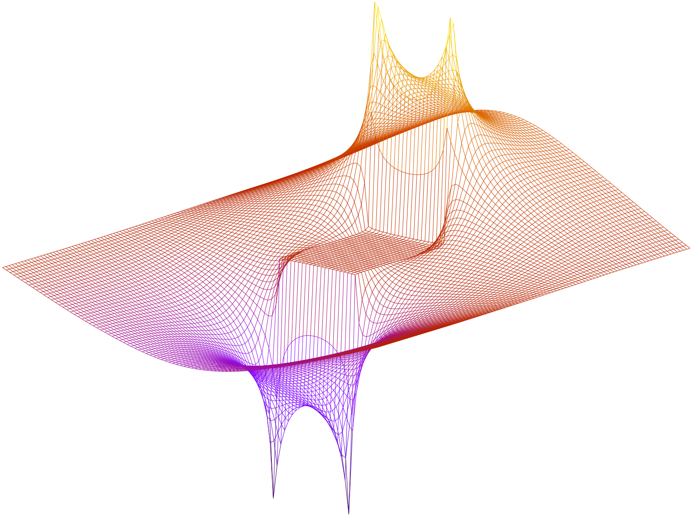

SEIDEL
======
This code solves the Laplace equation ∇<sup>2</sup>_u_ = 0 for electrostatic potentials _u_ bounded in concentric regions using the Gauss–Seidel algorithm with [successive over-relaxation](https://en.wikipedia.org/wiki/Successive_over-relaxation).

Build
-----
Clone and `make && make clean`.

If building on macOS, first `brew install argp-standalone` and
```bash
export CFLAGS="$CFLAGS -I/usr/local/include/"
export LDFLAGS="$LDFLAGS -L/usr/local/lib/ -largp"
```
to make GLIBC argument parsing available.

Run
---
`./seidel` with no arguments will print the (automatically chosen) parameters and the value of the double integral of _E_<sup>2</sup> over the region, a measure of the total electric field.

Run with `--help` to expose the optional flags.

    Usage: seidel [-cpqrt?] [-a a] [-b b] [-n n] [-w w] [--xboundary=a]
            [--yboundary=b] [--clean] [--size=n] [--print] [--norelax]
            [--relax] [--translate] [--omega=w] [--help] [--usage]

The boundary point (_a_, _b_) defines the north-west point of the inner boundary.

`./seidel --print` produces data files of the form

    x   y   f(x,y)

for the potential (`u.dat`), the _x_- and _y_- components of the electric field (`ex.dat`, `ey.dat`) and a file `cs.dat` of the form

    y   E_x   E_y

which is a cross-section of the electric field at _x_ = 0.5 * _n_. These files can be removed with `--clean` (and also with `make delete`). Run the `.plt` scripts to plot the results.

The `--translate` option outputs the value of the integral _L_ (above) as the inner boundary is translated vertically through the region.

The program over-relaxes by default (using successive over-relaxation parameter _ω_ = 1.92, the optimum value for the default configuration). This can be disabled with `--norelax` (which sets _ω_ = 1), assigned with `--omega` or calculated with `--relax`, which prints the value of _ω_ and the number of iterations required for the solution to converge until it hits the minimum.


